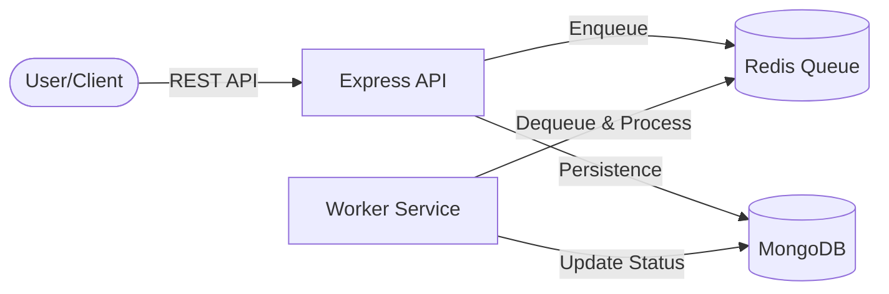

# 🚀 Distributed Task Queue & Worker System

A high-performance, scalable backend system designed for asynchronous task processing. This project decouples task intake from execution using a message queue architecture, ensuring the API remains responsive while background workers handle heavy-duty processing.

---

## 🏗️ Architecture

The system consists of four primary components working in harmony:



1.  **API Service**: Express.js server that handles task creation, retrieval, and retry logic.
2.  **Redis (BullMQ)**: Serves as the high-speed message broker and queue manager.
3.  **Worker Service**: Independent Node.js service that processes background jobs.
4.  **MongoDB**: Stores task metadata, status (Pending/Completed/Failed), and result payloads.

---

## ✨ Key Features

- **Asynchronous Processing**: Immediate API responses while tasks run in the background.
- **Reliable Retries**: Manual and automatic retry mechanisms for failed tasks.
- **Dockerized**: Fully containerized multi-service setup for local dev and cloud production.
- **Cloud Ready**: Successfully deployed and verified on Azure Container Apps.
- **Health Monitoring**: Built-in health check endpoints for infrastructure monitoring.

---

## 🛠️ Tech Stack

- **Runtime**: Node.js (v22+)
- **Framework**: Express.js (ES Modules)
- **Queue**: BullMQ + Redis
- **Database**: MongoDB (Mongoose)
- **Containerization**: Docker & Docker Compose
- **Testing**: Jest & Supertest
- **Cloud**: Azure (Container Apps), MongoDB Atlas

---

## 🚀 Getting Started

### Prerequisites
- Docker & Docker Desktop
- Node.js (if running locally without Docker)

### Local Setup (Recommended)
The easiest way to run the entire stack is using Docker Compose:

```bash
# Clone the repository
git clone [your-repo-url]
cd Distributed-Task-Queue-Worker-System

# Start the cluster
docker compose up --build
```

The API will be available at `http://localhost:4000`.

---

## 🔌 API Documentation

### Task Endpoints

| Method | Endpoint | Description |
| :--- | :--- | :--- |
| **POST** | `/tasks` | Create a new background task |
| **GET** | `/tasks` | List all tasks with status |
| **GET** | `/tasks/:id` | Get details of a specific task |
| **POST** | `/tasks/:id/retry` | Manually retry a failed task |
| **GET** | `/health` | Check API & dependency health |

---

## ☁️ Cloud Deployment

This project is configured for seamless deployment to **Azure Container Apps**.

### Production Infrastructure:
- **Environment**: Azure Container Apps Environment
- **Queue**: Internal Redis Container
- **Database**: MongoDB Atlas Cluster
- **Networking**: API (External Ingress), Worker (Internal only)

---

## 🧪 Testing

Run the integration and unit tests for both services:

```bash
# API Tests
cd api && npm test

# Worker Tests
cd worker && npm test
```

---

## 📄 License
MIT License - Developed for Portfolio & Distributed Systems exploration.
